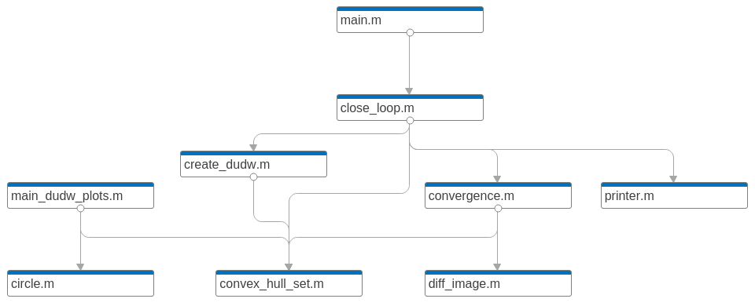

# Simulation-Gear-Belt

Tested in:
* MATLAB 2020b - Windows 10 Education (2018).
* MATLAB 2020b - macOS Catalina Version 10.15.7.
* MATLAB 2021a - Ubuntu 18.04.5 LTS.

##  Introduction

This repository contains all scripts utilized in _Experiment in robotic self-repair_. We construct a mathematical model to simulate the interaction between the rotation of a non-standard timing pulley and its associated timing belt. In the article, we show an experiment where a 3D printer reaches self-repair under some conditions. Even when the capacity of a 3D printer to print some of its parts seems trivial, it becomes challenging when the printer presents some malfunctions.

## Functions description

* **h = circle(x,y,r,len)** creates the plot h with a circle of center in _(x,y)_, radius _r_, and LineWidth _len_.
* **[set_x, set_y, len, I] = convex_hull_set(picname)** loads the picture _picname_, and creates its convex hull. The sets _set_x_ and _set_y_ are the coordinates for each convex hull's vertex. The set _len_ contains the distances of each vertex to the center _(0,0)_. Finally, _I_ is the post-process image which now is in format _int8_.
* **[diff] = diff_image(img1,img2)** calculates the relative difference between figures _img1_ and _img2_, and provides it as an output in _diff_.
* **main_dudw_plots** loads a pulley's image, calculates its convex hull utilizing _convex_hull_set_, and plots the instant derivative du/dw. It also provides an animation that helps in visualizing how the derivative is calculated. **We recommend to check it out!**
* **[deriv_norm] = create_dudw(figure_name, Nw, dudw_norm)** loads pulley's image _figure_name_, and creates the vector _deriv_norm_ with the values of the derivative du/dw from 0 to 2pi with _Nw_ discretizations.
* **[] = convergence(pulley, model_3D, num_iter)** creates and saves the convergence plots from the inital pulley _pulley_, to the reference _model_3D_. _num_iter_ is the number of ploted iterations. 
* **output = printer(input,w0,dudw,ratio_pd)**